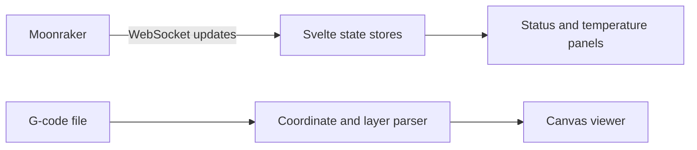

# KlipperViewer — live printer dashboard

**Svelte · JavaScript · Vite · WebSocket · JSON-RPC · Canvas**

A browser dashboard for a Klipper 3D printer using Moonraker's API. It brings printer state and a G-code view into one interface.

## Implementation

- Connected to Moonraker over WebSocket JSON-RPC and matched responses to pending requests by ID.
- Subscribed to printer objects, queried initial state, and merged incremental updates into Svelte stores.
- Added reconnect behavior with increasing delays capped at 15 seconds.
- Parsed G-code movement into coordinates, layer heights, and bounds for canvas rendering.
- Added status, temperature, camera, and G-code display components.

## Data flow

## Engineering details

**Initial state and deltas:** the client obtains a full state after connecting, then merges updates. This keeps the UI from relying only on changes that happen after it opens.

**Connection state is visible:** connecting, connected, reconnecting, and error states help distinguish stale information from a live connection.

**File interpretation is separate from presentation:** G-code parsing returns layer data and bounds; the display component handles drawing. This makes the parser a focused target for fixture-based validation.

## Scope and limits

This is a personal dashboard with private source. The parser supports a subset of G-code movement and coordinate modes; it is not a complete interpreter. Useful next checks include pending-request cleanup on disconnect, malformed messages, unusual G-code commands, and large-file rendering performance. Running the live dashboard requires a configured Moonraker instance.

[Back to portfolio](../README.md)
