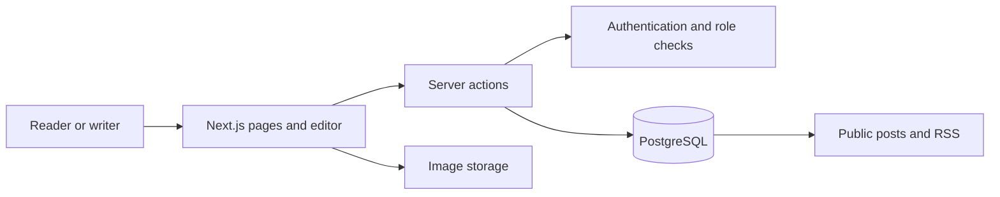

# LiveLife — publishing application

**Next.js · React · TypeScript · PostgreSQL · Supabase · Tailwind CSS**

LiveLife is a personal publishing application. A writer creates and publishes Markdown posts through a browser dashboard; readers browse posts, subscribe through RSS, and sign in to comment.

## Implementation

- Built the public post pages and writer dashboard around a draft/published workflow.
- Added a Markdown editor with preview, syntax highlighting, sanitized rendering, and image insertion.
- Implemented email/password authentication, password-reset flows, and reader/writer roles.
- Modeled profiles, posts, and comments with relational constraints and database access policies.
- Added comments and replies, plus an RSS feed for published posts.

## How the pieces fit

The interface offers different actions to readers and writers. Server-side checks and PostgreSQL row-level policies express the corresponding access rules. Foreign keys, unique slugs, and comment-length constraints also protect the data model.

## Engineering details

- **Duplicate slugs:** database unique-constraint errors become an actionable message in the editor.
- **Editing published posts:** edits preserve the existing publication timestamp while a post remains published. Returning a post to draft clears it; republishing assigns a new timestamp.
- **Fresh public pages:** post actions revalidate affected pages after a change, including old and new slug paths.
- **Rich content:** Markdown rendering applies a sanitization schema and supports code highlighting. Uploads use generated filenames.

## Scope and next validation

This is a personal application with private source. The writeup describes implemented behavior, not measured traffic or production-scale performance. Further validation should exercise reader/writer permissions through both the application and direct database access, draft visibility, duplicate slugs, publication transitions, and untrusted Markdown.

[Back to portfolio](../README.md)
