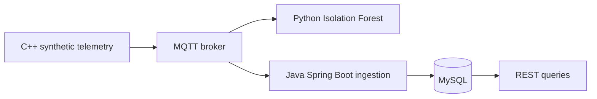

# OmniNode — telemetry and anomaly-detection prototype

**C++ · Python · Java · Spring Boot · MQTT · MySQL · scikit-learn**

OmniNode connects a synthetic telemetry generator, an anomaly detector, and a persistence API through a message broker. It is a personal prototype for exploring how independently implemented services exchange data.

## Architecture

## Implementation

- Generated timestamped temperature and vibration readings from nominal and fault states in C++.
- Published JSON messages with MQTT and consumed them in Python.
- Trained an Isolation Forest on 120 nominal readings, then compared predictions with the generator's state labels using true/false positive/negative counters.
- Built a Java/Spring Boot consumer that parses readings and persists them with Spring Data JPA.
- Exposed REST endpoints for record count and the latest 20 readings.

## Engineering details

**Explicit message fields:** timestamp, state, temperature, and vibration give each consumer a shared interpretation of a reading.

**Separate responsibilities:** generation, scoring, and persistence live in separate programs. The broker provides the common transport rather than coupling model inference to the storage API.

**Evaluation against known states:** synthetic labels make it possible to compare detector output with the generator's intent. That measures behavior within the simulation; it does not establish real-world fault-detection accuracy.

## Scope and limits

The project uses synthetic data and has private source. The Java persistence service is present in the local implementation alongside the generator and detector. This is not a deployed predictive-maintenance system. Load testing, message deduplication, restart behavior, and a repeatable end-to-end test harness remain useful next steps.

[Back to portfolio](../README.md)
