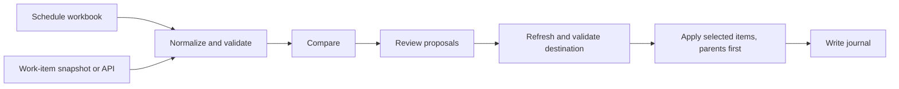

# Project Manager — schedule and work-item comparison

**Python · Textual · Pandas · openpyxl · REST APIs · unittest**

A terminal application for comparing P6 schedules with Azure DevOps work items, then reviewing proposed changes before applying selected items.

## Implementation

- Imported workbooks, versioned JSON snapshots, and an explicit read-only live API source.
- Normalized records while retaining hierarchy, related IDs, and completeness information.
- Checked for conflicting parents, cycles, missing hierarchy, and invalid snapshot formats.
- Added a review workflow for proposed work items, followed by revision and destination-state checks before writes.
- Recorded write attempts and returned IDs so a failure can be investigated before retrying.

## Data flow

## Decisions that matter

**Incomplete reads stay visible.** When API batches include unavailable items, the importer can isolate those IDs and preserve readable records with an explicit completeness warning. It does not silently treat a partial response as the entire project.

**Hierarchy is part of the model.** Missing or contradictory parent relationships can change the meaning of a proposed item. Validation happens before proposals are prepared, and writes order parents before children.

**A timeout is not proof of failure.** A request may reach the server even if its response is lost. The tool records attempts and stops on failure; reconciliation is needed before deciding whether to retry an uncertain write.

**Offline development is practical.** A standalone exporter and synthetic fixtures support development without a live server. The offline test setup blocks unmocked HTTP requests.

## Scope and limits

This is a public description of the tool's design. Source, real schedules, work-item records, organization details, and credentials remain private. The repository's offline tests cover local behavior; live process rules and server behavior require separate integration validation. Saved review documents do not currently resume an application session.

[Back to portfolio](../README.md)
